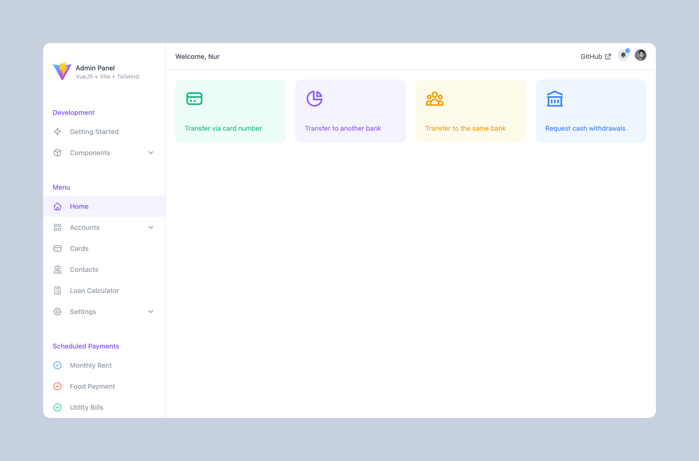

# Admin Panel

Created with VueJS + Vite + Tailwind

Hi, this project is still in progress. I just begin my journey with Tailwind CSS, so I want to make something beautiful and useful. Let's learn together!

[View the demo 🚀](https://ngekoding.github.io/admin-panel)

## How to install
1. Clone or download this repository
2. Enter to `admin-panel` directory (with Terminal/CMD)
3. Run: `npm install`
4. Run: `npm run dev` for development, then open your favorite browser and go to address `localhost:3000`
5. Run: `npm run build` for production
6. Make your own changes and happy coding!

## Icons

For the icons, I use [Heroicons](https://heroicons.com) as mentioned on [Tailwind CSS - Resources](https://tailwindcss.com/resources). And for simplicity used, I combining with [vite-plugin-components](https://github.com/antfu/vite-plugin-components)  to make it imported on-demand.

This configuration also supported both for `outline icon` and `solid icon`.

Patterns: 
- `{name}-icon-o` for outline icon
- `{name}-icon-s` for solid icon

Examples: 

```vue
<home-icon-o class="w-6 h-6 text-gray-500" />
```

```vue
<external-link-icon-s class="w-6 h-6 text-gray-500" />
```

Note for `menu-item` component, you just need to use the prop to define the icon. For example:

```vue
<menu-item icon="cube-icon-o" text="Components" :route="{name: 'components'}">
```

## Screenshots

Here is some screenshots. And please note, because this project is still in progress, you can found the latest update on [demo page](https://ngekoding.github.io/admin-panel).

Hope you love it!




Powered by ngekoding.github.io